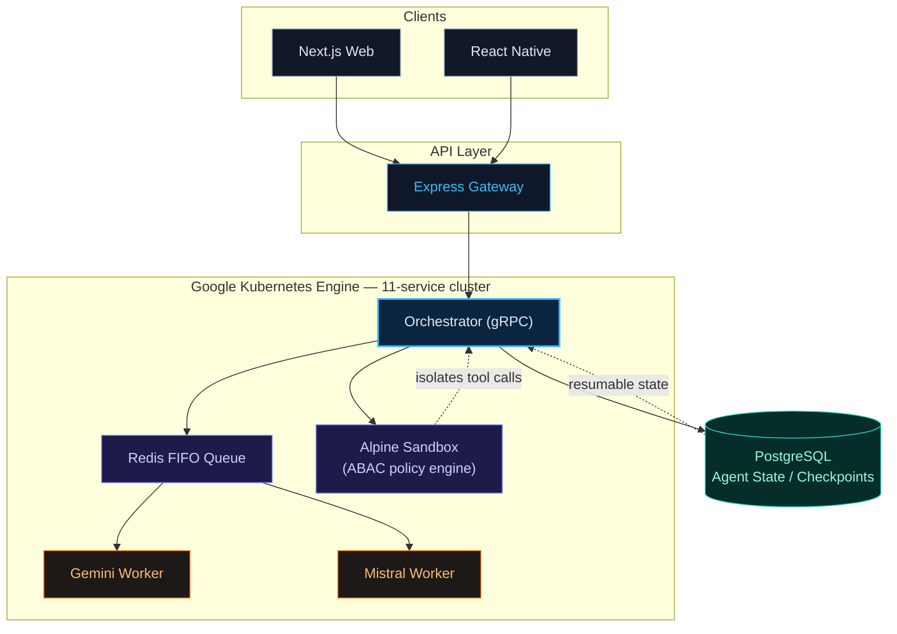

<div align="center">


<br/>


<br/><br/>


<br/>


<br/>

<p align="center">
  
  
  
</p>

</div>

<br/>

<div align="center">

```ts
const engineer = {
  name: "Piyush Rathore",
  role: "Full Stack + AI/ML Engineer",
  title: "Co-Founder & CTO @ Evoc Labs",
  education: "B.Tech CSE (AI/ML) @ MAIT, New Delhi — Class of 2028",
  focus: ["Distributed Systems", "RAG / LLM Agent Infra", "Real-time & Event-driven Backends"],
  status: "🏆 Top 4 / 500+ National Hackathon Finalist",
  currentlyShipping: true,
};
```

</div>

<br/>

<div align="center">

[](https://piyushdevs.space)
[](https://www.linkedin.com/in/piyussshhh/)
[](https://github.com/Piyush0000)
[](mailto:piyushrathorecodes@gmail.com)

</div>

<br/>


## 👨‍💻 About Me

```yaml
Name:         Piyush Rathore
Role:         Full Stack + AI/ML Engineer
Location:     New Delhi, India
Education:    B.Tech CSE (AI/ML) @ MAIT — Class of 2028

Currently:
  - Co-Founder & CTO @ Evoc Labs — multi-tenant, AI-powered B2B/D2C SaaS
    → 20+ merchants in production, ~2,000 daily user sessions
    → hundreds of concurrent COD orders/day at sub-second API latency
  - Full Stack Developer Intern @ Modulus Seventeen — mobile-first commerce SaaS

Focused On:
  - Distributed systems & system design at scale
  - Async-first, event-driven backend architecture
  - AI product engineering (RAG, LLM agent orchestration, explainable ML)

2026 Goal: Ship systems that don't just work in a demo — they hold up in production.
```


## ⚡ Engineering Philosophy

<table>
<tr>
<td width="50%">

- 🏗️ Architect before scaling
- ⚙️ Async-first, event-driven backend design
- 🧪 Real-world ML > notebook ML

</td>
<td width="50%">

- 🧹 Clean APIs, maintainable systems
- 🚀 Performance is a feature, not an afterthought
- 🔍 Explainability & guardrails matter in AI systems

</td>
</tr>
</table>


## 🚀 Tech Arsenal

<div align="center">

**Languages**
<br/>


**Frontend & Mobile**
<br/>

<br/>


**Backend**
<br/>

<br/>


**AI / ML / Agents**
<br/>

<br/>


**Databases, Infra & Cloud**
<br/>

<br/>


**Auth & Payments**
<br/>


**Web3 & Blockchain**
<br/>


</div>


## 🧭 My Journey — Architected as a Pipeline

```mermaid
flowchart LR
    A["🎓 MAIT, New Delhi\nB.Tech CSE (AI/ML)\n2024 – 2028"]:::edu
    B["🌐 TheBookShelves\nFull Stack Intern\nJul–Oct 2025"]:::stage
    C["🏦 Oriental Solutions\nSDE Intern — AI bots\nDec 2025–Jan 2026"]:::stage
    D["🚀 Evoc Labs\nCo-Founder & CTO\nDec 2025 – Present"]:::flagship
    E["🏫 Delhi School of Mgmt\nWeb Dev Intern\nFeb–Mar 2026"]:::stage
    F["📦 Modulus Seventeen\nFull Stack Intern\nAug–Sep 2026"]:::stage
    G["🏆 Top 4 / 500+\nNational Hackathon\n+ 20 Production Projects"]:::milestone

    A --> B --> C --> D
    D --> E --> F --> G

    classDef edu fill:#0f172a,stroke:#38bdf8,stroke-width:2px,color:#e2e8f0
    classDef stage fill:#111827,stroke:#64748b,stroke-width:1.5px,color:#cbd5e1
    classDef flagship fill:#0a2540,stroke:#38bdf8,stroke-width:3px,color:#38bdf8
    classDef milestone fill:#1e1b4b,stroke:#f97316,stroke-width:2px,color:#fbbf24
```



`0 → founding engineer` · `4 internships across AI, fintech, edtech & commerce` · `still building Evoc Labs in parallel`

<div align="center">

</div>


## 🧠 System Design — AgentOS Architecture

A snapshot of how I think about scaling stateless AI inference across a containerized cluster:



`Zero duplicate LLM token spend` · `Prompt-injection & RCE isolation via sandboxed tool calls` · `Seamless resumption via checkpointed state`


## 🏗️ What I Build

<table>
<tr>
<td valign="top" width="33%">

### ⚡ Scalable Backend Systems
- Multi-tenant SaaS architecture
- Async job queues (BullMQ + Redis)
- Event-driven pipelines & DLQs
- Distributed locking, idempotency
- Saga-pattern rollback-safe transactions

</td>
<td valign="top" width="33%">

### 🤖 AI-Powered Applications
- RAG pipelines & vector search
- Multi-agent orchestration on GKE
- Browser-side ML inference
- Explainable AI (SHAP)
- ABAC-guarded tool execution sandboxes

</td>
<td valign="top" width="33%">

### 🌍 Full Stack Platforms
- MERN & Next.js applications
- Real-time WebSocket dashboards
- Payment & third-party integrations (Razorpay, FCM)
- Production-grade deployments (GKE, Azure, VPS)

</td>
</tr>
</table>


## 💼 Experience

<table>
<tr><td width="100%">

**Co-Founder & CTO — Evoc Labs Pvt. Ltd.** · *Dec 2025 – Present*
Built and scaled a B2B SaaS platform (Node.js, PostgreSQL, Redis on VPS) serving 20+ merchants and ~2,000 daily user sessions, handling hundreds of concurrent COD orders/day at sub-second API latency under campaign traffic spikes. Owned end-to-end checkout/COD backend — order creation, status updates, reconciliation — with caching, connection pooling and idempotent operations for zero failed transactions across thousands of orders/month.

</td></tr>
<tr><td>

**Full Stack Developer Intern — Modulus Seventeen** · *Aug 2026 – Sep 2026*
Shipped full-stack features across backend, React Native app, and React web for a connected commerce & supply-chain SaaS — billing, inventory, order placement, delivery tracking — in a mobile-first ecosystem.

</td></tr>
<tr><td>

**Web Development Intern — Delhi School of Management** · *Feb 2026 – Mar 2026*
Owned end-to-end delivery of responsive portal modules deployed into live departmental workflows, replacing manual processes; worked directly with project leads under fixed academic-calendar deadlines.

</td></tr>
<tr><td>

**Software Developer Intern — Oriental Solutions Pvt. Ltd.** · *Dec 2025 – Jan 2026*
Shipped full-stack features into production and designed AI-driven bots + Python automation scripts that removed repetitive manual effort, running unattended in production.

</td></tr>
<tr><td>

**Full Stack Web Developer Intern — TheBookShelves** · *Jul 2025 – Oct 2025*
Built production RESTful APIs (Node.js, Express) powering secure MongoDB data access; re-engineered schemas and indexing strategy, cutting query latency and improving page loads.

</td></tr>
</table>


## 🧩 Featured Projects

<table>
<tr>
<td width="50%" valign="top">

### 🚀 Evoc Labs
**Multi-Tenant AI-Powered B2B/D2C SaaS**
*Co-Founder & CTO*

- 20+ merchants, ~2,000 daily user sessions in production
- Redis + connection pooling for sub-second latency under traffic spikes
- Idempotent checkout/COD workflows — zero failed transactions

`Node.js` `PostgreSQL` `Redis` `React`

</td>
<td width="50%" valign="top">

### 🧠 AgentOS
**Multi-Tenant AI Agent Orchestration Platform**

- Containerized 11-service cluster on GKE, gRPC + Redis FIFO queue routing inference across Gemini & Mistral with zero duplicate token spend
- ABAC-policy sandboxed tool-call execution in isolated Alpine containers, checkpointing agent state to PostgreSQL

`Next.js` `Express` `Python` `gRPC` `GKE` `Redis` [🔗 GitHub]

</td>
</tr>
<tr>
<td width="50%" valign="top">

### 💸 FinPay
**Distributed Wallet & Payment Platform**

- 7-service microservices backend (auth, wallet, transaction, worker, notification, analytics) with Saga-pattern rollback-safe transfers
- Redis distributed locking + idempotency keys, sub-200ms p99 latency
- Event-driven BullMQ/PubSub pipeline with exponential-backoff retries + DLQ

`Node.js` `MongoDB` `Redis` `BullMQ` `Microservices` [🔗 GitHub]

</td>
<td width="50%" valign="top">

### 🎟️ CodeSpirit
**Event & Hackathon SaaS Platform**

- Multi-role platform across web, mobile & backend, designed for 1M+ concurrent users, scaled to 1,000+ active users
- Real-time chat, QR check-ins, RBAC, Razorpay payments — Socket.io + Redis + JWT, deployed on Azure with FCM push

`Node.js` `React` `React Native` `MongoDB` `Redis` `Socket.io` [📱 Android] [🔗 Web]

</td>
</tr>
<tr>
<td width="50%" valign="top">

### ⚡ Power Line Fault Detection
*Top 4 / 500+ National Hackathon Finalist*

- Real-time AI fault-detection for power transmission lines
- Browser-side CV pipeline classifying faults from live video
- WebSocket-streamed alerts, zero manual polling

`TensorFlow.js` `Socket.io` `MERN` [🔗 Live Demo]

</td>
<td width="50%" valign="top">

### 📈 LR21 — Web3 Trading Platform
**Production Web3 Platform — Web & Mobile**

- ML-driven trading bot with on-chain execution (BNB Smart Chain)
- Real-time price feeds, NFT marketplace, DAO governance voting
- Shared trading logic across React web & React Native mobile

`React` `React Native` `Node.js` `Python` `Web3.js`

</td>
</tr>
</table>


## 📊 GitHub Analytics

<div align="center">


<br/>


<br/><br/>


</div>


## 🐍 Contribution Snake &nbsp;·&nbsp; 🧊 3D Contribution Graph

<div align="center">


<sub><i>(Requires the <a href="https://github.com/Platane/snk">snk GitHub Action</a> set up on your profile repo.)</i></sub>

<br/><br/>


<sub><i>(Requires the <a href="https://github.com/yoshi389111/github-profile-3d-contrib">github-profile-3d-contrib</a> GitHub Action set up on your profile repo — generates this isometric 3D calendar automatically every day.)</i></sub>

</div>


## 🏆 Achievements

<div align="center">

🏅 &nbsp;**Top 4 / 500+** National Hackathon Finalist &nbsp;|&nbsp; 🏅 &nbsp;**Top 10** Finishes — Healthcare & LegalTech MVPs
🏅 &nbsp;20+ Production & Research Projects &nbsp;|&nbsp; 🏅 &nbsp;5 Internships across AI & Full Stack
🏅 &nbsp;Open Source Contributor — GSSoC · SWoC · IWOC
🏅 &nbsp;Kaggle Competition — Top 41% (1400/3433) &nbsp;|&nbsp; 🏅 &nbsp;Google AI Agents Intensive Participant
🏅 &nbsp;100+ DSA problems solved — arrays, binary search, sorting, strings, recursion, linked lists

</div>


## 📚 Certifications

<div align="center">


</div>


## 🤝 Open Source & Community

- 🌱 Contributor — **GSSoC**, **SWoC**, and **IWOC**
- 🎓 Member of **Startup Sphere, MAIT**
- 🧑‍🏫 Mentoring early-stage builders & reviewing systems architecture
- 💡 Passionate about scalable engineering and developer tooling


## 📫 Let's Connect

<div align="center">

[](https://piyushdevs.space)
[](https://www.linkedin.com/in/piyussshhh/)
[](https://github.com/Piyush0000)
[](mailto:piyushrathorecodes@gmail.com)

</div>


