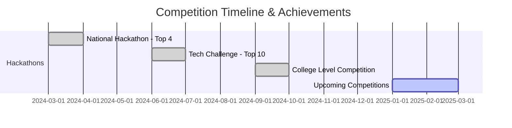

# 👨‍💻 Piyush Rathore

<div align="center">

[](https://git.io/typing-svg)


</div>

---

## 🚀 About Me

```python
class PiyushRathore:
    def __init__(self):
        self.username = "Piyush0000"
        self.location = "Delhi, India"
        self.education = "B.Tech CSE (AI & ML) @ MAIT"
        self.graduation_year = 2028
        self.current_focus = ["Machine Learning", "Full Stack Development", "Computer Vision"]
        self.achievements = ["🏆 Top 4 in National Hackathon", "🥈 Top 10 in Tech Challenge"]
        
    def say_hi(self):
        print("Thanks for dropping by! Let's build something amazing together!")

piyush = PiyushRathore()
piyush.say_hi()
```

🎓 **Computer Science Student** specializing in **AI & ML** at Maharaja Agrasen Institute Of Technology  
🔭 Currently building **intelligent healthcare platforms** and **ML-powered applications**  
🌱 Exploring **Deep Learning**, **Computer Vision**, and **NLP**  
🏆 **Hackathon Winner** with multiple top positions in national competitions  
💡 Passionate about creating **real-world impact** through technology  
📫 Reach me: **rathorepiyush0000@gmail.com**

---

## 💼 Professional Experience

### 🔹 Full Stack Web Developer Intern
**August 2025 – September 2025**
- Architected scalable database structures supporting high-performance applications
- Optimized complex queries and implemented indexing strategies for 40% faster data retrieval
- Developed stored procedures and triggers ensuring data integrity across systems

### 🔹 Database Developer Intern
**May 2025 – July 2025**
- Designed normalized MySQL schemas for enterprise-level applications
- Built RESTful APIs using PHP for seamless database integration
- Collaborated on performance tuning achieving 50% improvement in query execution time

---

## 🛠️ Tech Stack

<details open>
<summary><b>⚡ Core Technologies</b></summary>
<br>

**Languages:**
```text
Python       ████████████████████░   95%
JavaScript   ███████████████░░░░░   75%
C++          ██████████████░░░░░░   70%
Java         ████████████░░░░░░░░   60%
SQL          ███████████████░░░░░   75%
```

**Frameworks & Libraries:**


**AI/ML & Data Science:**


**Databases:**


**Tools & Platforms:**


</details>

---

## 🎯 Featured Projects

<table>
<tr>
<td width="50%">

### 🔌 Low Tension Lines Fault Detection
**MERN Stack + Machine Learning**

- Built full-stack application for real-time fault monitoring
- Integrated ML model for predictive maintenance
- Optimized route efficiency using scikit-learn algorithms
- **Tech:** MongoDB, Express, React, Node.js, Python

</td>
<td width="50%">

### 💳 Credit Risk Prediction System
**ML + Streamlit Web App**

- Trained Extra Trees Classifier on German Credit dataset
- Real-time risk assessment with 85%+ accuracy
- Interactive web interface with instant predictions
- **Tech:** Python, Streamlit, Scikit-learn, Pandas

</td>
</tr>

<tr>
<td width="50%">

### 🏋️ Angle & Bicep Movement Tracker
**Computer Vision Application**

- Real-time posture analysis using MediaPipe
- Accurate arm angle and movement tracking
- Applications in fitness & physiotherapy
- **Tech:** Python, OpenCV, MediaPipe

</td>
<td width="50%">

### ❤️ Heart Disease Prediction Model
**Healthcare ML Solution**

- Predictive model with comprehensive evaluation
- ROC curve analysis and precision metrics
- Data preprocessing and feature engineering
- **Tech:** Pandas, NumPy, Scikit-learn

</td>
</tr>

<tr>
<td width="50%">

### 🗣️ Argumate – AI Debate Platform
**NLP-Powered Application**

- Real-time debate analysis and scoring
- NLP-based feedback for communication skills
- Structured argument evaluation system
- **Tech:** Python, NLP, Web Technologies

</td>
<td width="50%">

### 🚗 ReviveWheels – Sustainability Hub
**E-Commerce Platform**

- Vehicle repurposing and recycling marketplace
- EV conversion tracking system
- UPI payment integration
- **Tech:** MongoDB, Node.js, Express.js

</td>
</tr>

<tr>
<td width="50%">

### 🏥 Ved Seva – Rural Healthcare
**Telemedicine Platform**

- Virtual doctor consultation for villages
- Supabase authentication integration
- Emergency access features
- **Tech:** HTML, CSS, JavaScript, Supabase

</td>
<td width="50%">

### 🚦 Smart Transportation System
**Data Analytics Dashboard**

- Urban traffic & pollution analysis
- Interactive data visualizations
- Real-time insights for city planning
- **Tech:** Pandas, NumPy, Matplotlib

</td>
</tr>
</table>

---

## 🏆 Hackathon Achievements



🥇 **Top 4** - National Level Hackathon  
🥈 **Top 10** - Inter-College Tech Challenge  
🏅 Multiple recognitions for **innovative solutions** under tight deadlines  
💡 Specialized in **Healthcare**, **Legal Tech**, and **Sustainability** domains

---

## 📊 GitHub Statistics

<div align="center">
  


</div>

<div align="center">
  


</div>

<div align="center">


</div>

---

## 🎓 Certifications & Learning

<details>
<summary><b>📜 View All Certifications</b></summary>
<br>

| Certification | Issuer | Credential |
|--------------|--------|------------|
| 🎯 Big Data 101 | IBM SkillsBuild | [View](https://www.credly.com/badges/your-badge) |
| 🐍 Data Analysis With Python | IBM SkillsBuild | [View](https://www.credly.com/badges/your-badge) |
| 📊 Data Fundamentals | IBM | [View](https://www.credly.com/badges/your-badge) |
| 🤖 Data Science & ML | Udemy | [View](https://www.udemy.com/certificate/) |
| 💻 HackerRank Certified | HackerRank | [View](https://www.hackerrank.com/certificates/) |

</details>

---

## 🌟 Open Source Contributions

<div align="center">

[](https://swoc.tech)
[](https://iwoc.tech)

</div>

**Active contributor** to open-source projects focusing on:
- 🤖 Machine Learning libraries
- 🌐 Full-stack applications  
- 📚 Educational resources

---

## 💡 Leadership & Extracurriculars

```text
┌──────────────────────────────────────────────────┐
│  🚀 Venture Lab @ Startup Sphere                │
│     → Official Startup Society of MAIT           │
│     → Innovation & Entrepreneurship              │
├──────────────────────────────────────────────────┤
│  🤝 National Service Scheme (NSS)                │
│     → Community Service & Social Impact          │
│     → Leadership & Team Coordination             │
└──────────────────────────────────────────────────┘
```

---

## 📈 Contribution Graph

<div align="center">

[](https://github.com/Piyush0000)

</div>

---

## 🏅 GitHub Trophies

<div align="center">

[](https://github.com/ryo-ma/github-profile-trophy)

</div>

---

## 🤝 Connect With Me

<div align="center">

[](https://www.linkedin.com/in/piyussshhh/)
[](https://piyush-dev-portfolio.vercel.app/)
[](https://www.instagram.com/___piyushrathore___/)
[](mailto:rathorepiyush0000@gmail.com)
[](tel:+919717704058)

</div>

---

## 💭 Quote of the Day

<div align="center">


</div>

---

<div align="center">

### 📊 Profile Stats


---

### 💻 "First, solve the problem. Then, write the code." — John Johnson


**⭐ Star my repositories if you find them interesting!**  
**🔔 Follow me to stay updated on my latest projects!**

</div>
